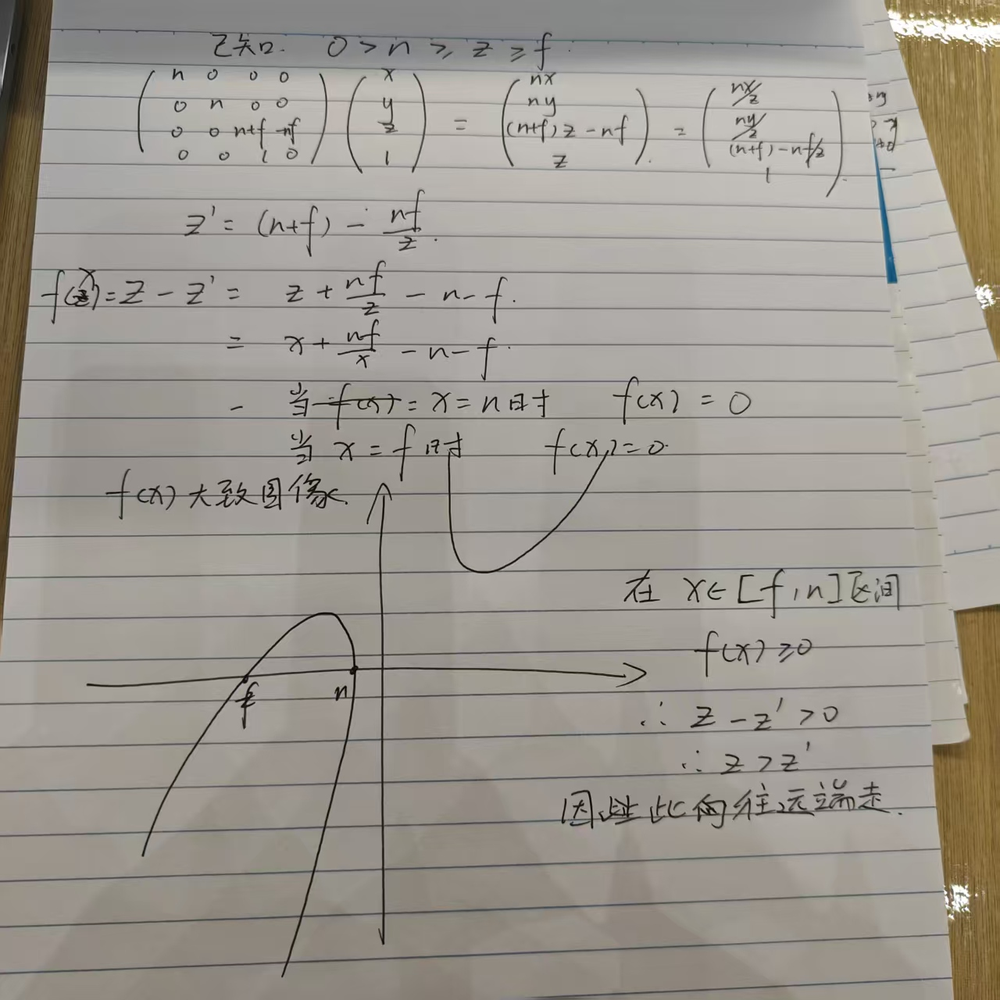

## 旋转矩阵的特性
> 旋转矩阵的逆 = 旋转矩阵的转置
> 这种矩阵叫做正交矩阵

## 三维变换

3D变换相对于2D变换来说只是多增加了一个维度，可由2D变换举一反三得来

## 三维旋转

3D旋转在绕Y轴旋转时理解有些特殊

以xyz三个轴来说

X x Y = Z  
Y x Z = X    
X x Z = -Y (叉乘)

所以绕Y轴旋转的矩阵表现出来是转置的状态

## 罗德里格斯旋转公式

我们说在三维空间内绕某一轴旋转，默认这个轴是过原点的

罗德里格斯旋转公式就是总结了绕任意过原点的轴旋转的公式

对于绕不过原点的轴旋转，我们可以将其拆分为

1. 将旋转轴平移到原点
2. 绕轴旋转
3. 将旋转后的模型平移回去

## 视图/相机变换

在现实生活中如何照一张照片？
1. 找个好地方摆pose（Model变换）
2. 把相机放个好角度（View变换）
3. 按快门（Projection变换）

View变换--如何摆放相机的角度
1. 决定相机的位置——e
2. 决定相机看向的方向——g
3. 决定相机头朝上的方向——t

**规定相机永远在（0，0，0），沿着-Z看
变化的永远是其他物体**

所以要先把摄像机归到原点
1. 平移摄像机至（0，0，0）
2. 将相机lookat的方向旋转到-z
3. 旋转相机头朝上的方向到Y

第一步的平移可以简单的写成下图Tview

但是要将任意向量旋转到轴上比较难写（也就是第2步和第三步）

但是将轴（如X轴（1，0，0））旋转到任意向量比较好写

所以我们先求将X轴旋转到任意向量的矩阵，之后将该矩阵求逆，即可得到任意向量旋转到轴的矩阵Rview

Rview x Tview = Mview

Mview即为视图变换，将Mview应用到相机，相机归零，同时也需要将Mview应用到其他所有物体，让物体和相机的相对位置保持不变

## 投影

### 正交投影

先将相机归零lookat -Z轴

对于二维投影来说，直接把Z轴坐标舍弃，就能得到物体在xy平面上的投影

要把得到的图像平移并且缩放到`[-1,1]²`中，方便之后的计算

Lecture 04 Transformation Cont. P4 - 45:15

对于正交投影来说，视口是个`[l,r][b,t][f,n]`的长方体,想让他变成`[-1,1]³`中的话只需要

- 先将立方体的中心平移到原点
    
- 在将立方体缩放到`[-1,1]³`中
    

首先要找到立方体的中心点，也就是

所以正交投影矩阵如下

(此时物体肯定会被拉伸，在之后的视口操作中会恢复拉伸）

## 透视投影

传统的欧式几何是在同一平面内生效的法则

对于不同平面就会造成照片中近大远小的情况

**如何做透视投影?**

老师的方法是，先将Frustum远平面及远平面到近平面之间的所有平面**挤压**到近平面大小，变成Cuboid的样子，然后做一次正交投影

**那么如何做挤压呢?**

我们已知一下三个条件
1. 近平面坐标永远不变
2. 远平面坐标的z值不变
3. 中心点不变

- 对于除近平面外的任意一个点，通过挤压后该点的高度y要变成和近平面一样的y’
- 从侧面看Frustum的话，如下图，可以形成两个相似三角形，即可得出y‘=(n/z)y
- 同理x'=(n/z)x

- 通过上面推导出来的两个公式可得，对于任意一点（x,y,z,1）T 可得
这里为了方便书写，用T来表示转置矩阵，下文同

将这个点同时乘z得

(齐次坐标同时乘k（k！=0），还得到相同的点）

- 所以我们推导出了变化后的点的一部分
就是:

- 那么一个矩阵乘以任意一点（x,y,z,1）T得到上图，我们就可以推导出这个矩阵的一部分了,如下图

想补全这个矩阵，需要用到两条已知的性质

1. 近平面的点不会发生变化
2. 远平面的点z的值不会发生变化

- 对于近平面上的点来说，他的z值就是n

由性质1可得  
对于近平面上的点（x,y,n,1）T经过矩阵变换后该点还为（x,y,n,1）T，同时乘n后得(nx,ny,n²,n）T  
所以当z等于n时，也就是说近平面的点通过矩阵运算后变为(nx,ny,n²,n）T

所以矩阵第三行乘以（x,y,n,1）T= n²  

可得第三行前两个数一定为0，即（0，0，A，B）

可得

1. An+B=n²

由性质2可得

选一远平面上的点x=0，y=0，即中间点（0，0，f,1）T，经矩阵变化后还是中间点（0,0,f,1）T，同时乘f后得（0，0，f²，f）T

即（0，0，A，B）(0，0，f,1）T=（0，0，f²，f）T

可得  
2. Af+B=f²

联立1、2得
A=n+f
B=-nf

至此可解出Mpersp -> ortho

所以对于空间中任意一点进行透视变换可以通过如下公式解出:

关于任意一点挤压后向哪里移动的问题，简单推导了一下:

