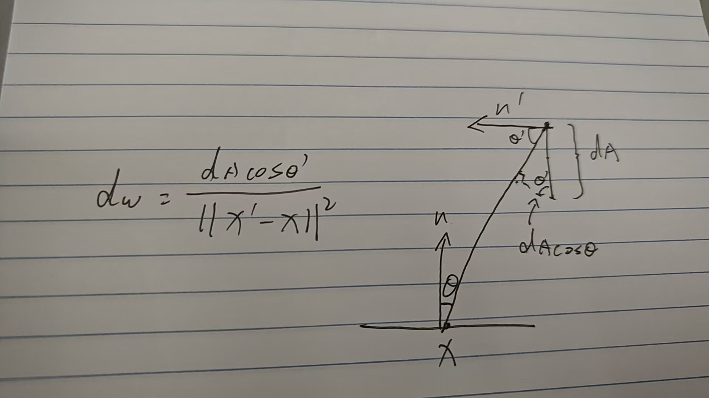

## 复习概率论的概念

## 蒙特卡洛积分

我们不想得到解析式,我们只想得到积分后的结果

蒙特卡洛积分的思想:随机采样
随机取一个x点,求出f(x)作为高,认为以f(x)为高的长方形这就是定积分的近似,重复多次采样取平均

核心过程:

均匀分布采样

均匀采样下的蒙特卡洛积分

得知道采样点的函数值和采样点的概率密度

## 路径追踪

回顾Whitted-Style Ray Tracing
- 光线打到漫反射物体,光线就停了
### Whitted-Style Ray Tracing的问题
无法实现glossy材质反射

无法实现漫反射折射的光线

根据渲染方程来解决问题

- 需要整个半球的积分
- 递归求解其他物体反射来的光照

使用蒙特卡洛方法来解半球的积分

认为点的光线方向朝外.

考虑直接光照情况(没有其他物体反射来的光)
在半球上采样

认为均匀采样(半球面积是2𝜋,半球面的立体角是2𝜋)

写成蒙特卡洛积分的形式

写出着色的算法流程
对于一个点和观测方向:

对每一个采样方向,发出一个光线,看看能不能打到光源

引入间接光照
如果打到的不是光源而是其他物体?

把Q看作光源就行

为什么是-wi,对于Q来说观测方向应该是从Q指向P,即-wi

这并没有解决问题

光线数量会爆炸

N只有等于1的时候指数才不会爆炸.

用一根光线(噪声明显)

用N=1来做蒙特卡洛积分——路径追踪

多个光线打向一个像素来得到着色结果

实现流程:
多个Path取平均

这个算法还有问题
没有终止条件!

本身光线就是无限次折射,如果限定的折射次数少了损失能量,又不能接受折射无数次.  
怎么办?

解决办法: Russian Roulette(RR)

有一定条件会停止路径追踪
定好一个概率
二值离散期望

伪代码:
随机取一个数ksi 判断和P_RR的关系来决定是否打光线

这已经是正确的代码了,但并不高效

效果跟路径数量相关

能不能打到光源纯看运气,很多光线浪费掉了(也就是说不能均匀采样),我们要对概率密度函数(pdf)动手了.

对着色点不再是向四面八方采样,而是对光源进行采样

蒙特卡洛积分是在立体角上积分,定义在半球上的,但是我们采样是在光源上的,这不行.

需要把渲染方程现成在光源(dA)上积分.

找出dw和dA的关系
光源投影到半球的立体角

简单的示意图:

重写渲染方程

对于光源(不需要俄罗斯轮盘赌)——不存在折射
对于非光源(需要俄罗斯轮盘赌)

结果代码

有物体遮挡的问题还没考虑

看看连线有没有打到物体.

