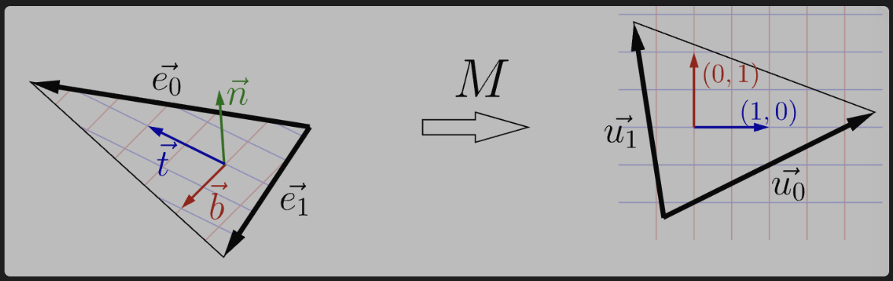

本项目目标就是学习光栅化的渲染管线,巩固知识.

具体项目源码在这:
https://github.com/Eureka1029/my_tinyrenderer

## 初始化

设置相机位置  (位置,方向,向上向量决定了待会如何将物体进行旋转)
设置输出图像大小  
设置光源位置  
设置阴影贴图尺寸 (这里设置为$8000*8000$使用暴力的方式来解决光源视图和相机视图间像素被拉伸的影响,避免出现阴影锯齿)
```cpp
    // 输出图像尺寸
    constexpr int width  = 800;
    constexpr int height = 800;
    // 阴影贴图缓冲区尺寸
    constexpr int shadoww = 8000;
    constexpr int shadowh = 8000;
    // 光源位置
    constexpr vec3  light{ 1, 1, 1};
    // 相机位置
    constexpr vec3    eye{-1, 0, 2};
    // 相机看向位置
    constexpr vec3 center{ 0, 0, 0};
    // 相机上向量
    constexpr vec3     up{ 0, 1, 0};

```


初始化MVP矩阵
`norm()` 求出向量的模
```cpp
    lookat(eye, center, up);
    init_perspective(norm(eye-center));
    init_viewport(width/16, height/16, width*7/8, height*7/8);
    init_zbuffer(width, height);
    // 创建帧缓冲区并用背景颜色初始化
    TGAImage framebuffer(width, height, TGAImage::RGB, {177, 195, 209, 255});
```

lootat()初始化
ModelView实现效果假定相机永远在原点 $(0,0,0)$ 且朝向固定。`View` 矩阵的作用是**将整个世界（包含所有物体）平移 `-eye` 的距离，并进行反向旋转**，使得所有物体最终落在以相机为原点的相对坐标系（Camera/View Space）中
```cpp
void lookat(const vec3 eye, const vec3 center, const vec3 up) {
    // 计算相机坐标系的三个基向量
    vec3 n = normalized(eye-center);      // 相机前方向量
    vec3 l = normalized(cross(up,n));     // 相机右向量
    vec3 m = normalized(cross(n, l));     // 相机上向量
    // ModelView = 旋转矩阵 * 平移矩阵
    ModelView = mat<4,4>{{{l.x,l.y,l.z,0}, {m.x,m.y,m.z,0}, {n.x,n.y,n.z,0}, {0,0,0,1}}} *
                mat<4,4>{{{1,0,0,-center.x}, {0,1,0,-center.y}, {0,0,1,-eye.z}, {0,0,0,1}}};
}
```


init_perspective()透视矩阵初始化.这里没有考虑宽高比的影响,而是直接用相似得出
```cpp
void init_perspective(const double f) {
    Perspective = {{{1,0,0,0}, {0,1,0,0}, {0,0,1,0}, {0,0, -1/f,1}}};
}
```

init_viewport()
初始化视口变换矩阵,将在`[-1,1]^3`的物体坐标转换为屏幕坐标
```cpp
void init_viewport(const int x, const int y, const int w, const int h) {
    Viewport = {{{w/2., 0, 0, x+w/2.}, {0, h/2., 0, y+h/2.}, {0,0,1,0}, {0,0,0,1}}};
}
```


init_zbuffer()
初始化深度缓冲区,并给定一个很小的负数作为初始值.
```cpp
void init_zbuffer(const int width, const int height) {
    zbuffer = std::vector<double>(width*height, -1000.);
}
```

## 渲染管线

### 顶点处理
遍历所有的面,取出所有的点,进行处理
```cpp
for (int m=1; m<argc; m++) {
        // 加载模型数据
        Model model(argv[m]);
        PhongShader shader(light, model);
        // 对所有面进行迭代
        for (int f=0; f<model.nfaces(); f++) {
            // 组装图元
            Triangle clip = { shader.vertex(f, 0),
                              shader.vertex(f, 1),
                              shader.vertex(f, 2) };
            // 光栅化图元
            rasterize(clip, shader, framebuffer);
        }
    }
```

vertex()顶点着色器
`normal()`获得顶点法线
`invert_transpose()` 矩阵逆矩阵转置
```cpp
virtual vec4 vertex(const int face, const int vert) {
	varying_uv[vert]  = model.uv(face, vert); //获得uv坐标
	varying_nrm[vert] = ModelView.invert_transpose() * model.normal(face, vert); //将法线转化到相机坐标系中
	vec4 gl_Position = ModelView * model.vert(face, vert);  //将顶点的局部/世界坐标，乘以视图矩阵（ModelView），转换到相机/视图空间（View Space）。也就是把物体拉到了以相机为原点的坐标系里。
	tri[vert] = gl_Position; //把转换到相机空间的顶点坐标缓存到 `tri` 数组中。
	// 返回裁剪坐标
	return Perspective * gl_Position; //返回的是透视投影后的矩阵,这里要注意w != 0了,而是包含了深度信息..
}
```

结论: 让法线转化到相机坐标系,必须乘以逆转置矩阵
`Perspective * gl_Position` 相当于进行透视投影,并将深度信息存储到了w分量上.


### 三角形处理
将处理后的顶点组成图元(形成三角形)
```cpp
Triangle clip = { shader.vertex(f, 0),
				  shader.vertex(f, 1),
				  shader.vertex(f, 2) };
```


### 光栅化

```cpp
// 光栅化三角形：将裁剪坐标中的三角形转换为屏幕像素
void rasterize(const Triangle &clip, const IShader &shader, TGAImage &framebuffer) {
    // 将齐次坐标转换为标准化设备坐标（NDC）
    vec4 ndc[3]    = { clip[0]/clip[0].w, clip[1]/clip[1].w, clip[2]/clip[2].w };
    // 使用视口矩阵将 NDC 转换为屏幕坐标
    vec2 screen[3] = { (Viewport*ndc[0]).xy(), (Viewport*ndc[1]).xy(), (Viewport*ndc[2]).xy() };

    // 将三个顶点组成矩阵用于重心坐标计算
    mat<3,3> ABC = {{ {screen[0].x, screen[0].y, 1.}, {screen[1].x, screen[1].y, 1.}, {screen[2].x, screen[2].y, 1.} }};
    // 背面剔除 + 剔除面积小于一个像素的三角形
    if (ABC.det()<1) return;

    // 计算三角形的外包矩形框（左上角和右下角）
    auto [bbminx,bbmaxx] = std::minmax({screen[0].x, screen[1].x, screen[2].x});
    auto [bbminy,bbmaxy] = std::minmax({screen[0].y, screen[1].y, screen[2].y});
    // 使用 OpenMP 并行处理每个像素
#pragma omp parallel for
    for (int x=std::max<int>(bbminx, 0); x<=std::min<int>(bbmaxx, framebuffer.width()-1); x++) {
        for (int y=std::max<int>(bbminy, 0); y<=std::min<int>(bbmaxy, framebuffer.height()-1); y++) {
            // 计算像素点 {x,y} 相对于三角形的重心坐标（屏幕空间）
            vec3 bc_screen = ABC.invert_transpose() * vec3{static_cast<double>(x), static_cast<double>(y), 1.};
            // 转换为裁剪空间的重心坐标，处理透视变形问题
            vec3 bc_clip   = { bc_screen.x/clip[0].w, bc_screen.y/clip[1].w, bc_screen.z/clip[2].w };
            // 归一化重心坐标
            bc_clip = bc_clip / (bc_clip.x + bc_clip.y + bc_clip.z);
            // 屏幕空间重心坐标为负表示像素在三角形外部
            if (bc_screen.x<0 || bc_screen.y<0 || bc_screen.z<0) continue;
            // 线性插值计算像素的深度值
            double z = bc_screen * vec3{ ndc[0].z, ndc[1].z, ndc[2].z };
            // 深度测试：丢弃深度值不符合条件的片段
            if (z <= zbuffer[x+y*framebuffer.width()]) continue;
            // 调用片段着色器
            auto [discard, color] = shader.fragment(bc_clip);
            // 片段着色器可以丢弃当前片段
            if (discard) continue;
            // 更新深度缓冲区
            zbuffer[x+y*framebuffer.width()] = z;
            // 更新帧缓冲区
            framebuffer.set(x, y, color);
        }
    }
}
```


**将坐标标准化并转化到屏幕上**
```cpp
vec4 ndc[3]    = { clip[0]/clip[0].w, clip[1]/clip[1].w, clip[2]/clip[2].w }; //除以w分量,转化为一个标准点坐标

vec2 screen[3] = { (Viewport*ndc[0]).xy(), (Viewport*ndc[1]).xy(), (Viewport*ndc[2]).xy() }; //得到三角形的三个点在屏幕的坐标
```

**计算该三角形叉乘来判断方向(右手定理)**
```cpp
mat<3,3> ABC = {{ {screen[0].x, screen[0].y, 1.}, {screen[1].x, screen[1].y, 1.}, {screen[2].x, screen[2].y, 1.} }};
    // 背面剔除 + 剔除面积小于一个像素的三角形
if (ABC.det()<1) return;
```
`det()`是计算行列式
该矩阵计算行列式的结果:
$$(x_1 - x_0)(y_2 - y_0) - (x_2 - x_0)(y_1 - y_0)$$
正好是三角形叉乘.如果太小或者直接小于0,不进行光栅化了.


**计算屏幕三角形的包围盒**
```cpp
auto [bbminx,bbmaxx] = std::minmax({screen[0].x, screen[1].x, screen[2].x});
auto [bbminy,bbmaxy] = std::minmax({screen[0].y, screen[1].y, screen[2].y});
```


**处理每个像素**

求出重心坐标的权重 $(u, v, w)$
```cpp
vec3 bc_screen = ABC.invert_transpose() * vec3{static_cast<double>(x), static_cast<double>(y), 1.};
```
原理:

$$\begin{bmatrix} x_0 & x_1 & x_2 \\ y_0 & y_1 & y_2 \\ 1 & 1 & 1 \end{bmatrix} \begin{bmatrix} u \\ v \\ w \end{bmatrix} = \begin{bmatrix} x \\ y \\ 1 \end{bmatrix}$$ 
$$ABC = \begin{bmatrix} x_0 & y_0 & 1 \\ x_1 & y_1 & 1 \\ x_2 & y_2 & 1 \end{bmatrix}$$

$$ABC^T \cdot \vec{bc} = P$$


$$\vec{bc} = (ABC^T)^{-1} \cdot P$$


**透视校正插值**
```cpp
 vec3 bc_clip   = { bc_screen.x/clip[0].w, bc_screen.y/clip[1].w, bc_screen.z/clip[2].w };
```
三维的重心不等于二维的重心,因此直接用二维的重心坐标直接取值会出错,需要对权重进行透视矫正插值,也就是要除以1/w


**归一化权重** 保证权重和 = 1
```cpp
bc_clip = bc_clip / (bc_clip.x + bc_clip.y + bc_clip.z);
```


**判断是否在三角形内**
```cpp
if (bc_screen.x<0 || bc_screen.y<0 || bc_screen.z<0) continue;
```


**zbuffer深度测试**
深度测试的原理就是看看我当前深度和记录的深度谁大谁小,谁大谁应该显示(摄像机朝-z方向看)
```cpp
double z = bc_screen * vec3{ ndc[0].z, ndc[1].z, ndc[2].z };
		// 深度测试：丢弃深度值不符合条件的片段
		if (z <= zbuffer[x+y*framebuffer.width()]) continue;
		auto [discard, color] = shader.fragment(bc_clip);
		if (discard) continue; //如果被覆盖就不用画了
		// 更新深度缓冲区
		zbuffer[x+y*framebuffer.width()] = z;
		// 更新帧缓冲区
		framebuffer.set(x, y, color);
```


### 着色

片段着色器
```cpp
virtual std::pair<bool,TGAColor> fragment(const vec3 bar) const {
        // 计算切线空间的变换矩阵
        mat<2,4> E = { tri[1]-tri[0], tri[2]-tri[0] };
        mat<2,2> U = { varying_uv[1]-varying_uv[0], varying_uv[2]-varying_uv[0] };
        mat<2,4> T = U.invert() * E;
        // 构建 Darboux 坐标系
        mat<4,4> D = {normalized(T[0]),  // 切线向量
                      normalized(T[1]),  // 副法线向量
                      // 插值法线
                      normalized(varying_nrm[0]*bar[0] + varying_nrm[1]*bar[1] + varying_nrm[2]*bar[2]),
                      {0,0,0,1}}; // Darboux 坐标系基向量
        // 计算像素的纹理坐标
        vec2 uv = varying_uv[0] * bar[0] + varying_uv[1] * bar[1] + varying_uv[2] * bar[2];
        // 从法线贴图获取法线
        vec4 n = normalized(D.transpose() * model.normal(uv));
        // 计算反射光线方向
        vec4 r = normalized(n * (n * l)*2 - l);
        // 环境光强度
        double ambient  = .4;
        // 漫反射光强度
        double diffuse  = 1.*std::max(0., n * l);
        // 镜面光强度
        // 注意：相机在 z 轴上（眼睛坐标系），所以 (0,0,1)*(r.x, r.y, r.z) = r.z
        double specular = (1.+3.*sample2D(model.specular(), uv)[0]/255.) * std::pow(std::max(r.z, 0.), 35);
        // 获取基础颜色
        TGAColor gl_FragColor = sample2D(model.diffuse(), uv);
//      TGAColor gl_FragColor = {255, 255, 255, 255};
        // 应用光照计算
        for (int channel : {0,1,2})
            gl_FragColor[channel] = std::min<int>(255, gl_FragColor[channel]*(ambient + diffuse + specular));
        // 不丢弃该像素
        return {false, gl_FragColor};
    }
```


**构建对纹理切线向量进行扰动的矩阵TBN**
法线贴图存的是切线向量(局部的法线),需要用TBN将其
```cpp
        mat<2,4> E = { tri[1]-tri[0], tri[2]-tri[0] };
        mat<2,2> U = { varying_uv[1]-varying_uv[0], varying_uv[2]-varying_uv[0] };
        mat<2,4> T = U.invert() * E;
        mat<4,4> D = {normalized(T[0]), 
                      normalized(T[1]),  
                      normalized(varying_nrm[0]*bar[0] + varying_nrm[1]*bar[1] + varying_nrm[2]*bar[2]),
                      {0,0,0,1}}; // Darboux 坐标系基向量
```

如何得到TBN矩阵

定义边向量：

$$\begin{array}{ll}
\vec{e_0} & := P_1 - P_0 \\ %\begin{pmatrix}P_{1x} - P_{0x} \\P_{1y} - P_{0y} \\P_{1z} - P_{0z} \\ \end{pmatrix}
\vec{e_1} & := P_2 - P_0 \\
\vec{u_0} & := U_1 - U_0 \\
\vec{u_1} & := U_2 - U_0
\end{array}$$

那么，UV 映射可以用以下代码描述：$2 \times 3$ 矩阵 $M$: 

$$M \times \underbrace{\begin{pmatrix} \vec{e_0} & \vec{e_1} \end{pmatrix}}_{3\times 2~\text{matrix}} = \underbrace{\begin{pmatrix} \vec{u_0} & \vec{u_1} \end{pmatrix}}_{2\times 2~\text{matrix}}$$

以下是一个示例：



我们将  $3\times 2$ 矩阵 $E$ 以及 $2\times 2$ 矩阵 $U$ :

$$\begin{array}{ll}
E &:= \begin{pmatrix} \vec{e_0} & \vec{e_1} \end{pmatrix}\\
U &:= \begin{pmatrix} \vec{u_0} & \vec{u_1} \end{pmatrix}
\end{array}$$

因此，我们有 $M \times E = U$. 我们要求解切线向量 $\vec{t}$ 以及切向量 $\vec{b}$ 使得它们映射到单位 UV 轴上：

$$\begin{aligned} M\vec{t} &= \begin{pmatrix} 1 \\ 0 \end{pmatrix} \\ M\vec{b} &= \begin{pmatrix} 0 \\ 1 \end{pmatrix} \end{aligned}$$


或者，等效地， $M \times \begin{pmatrix} \vec{t} & \vec{b} \end{pmatrix} = \begin{pmatrix} 1 & 0 \\ 0 & 1 \end{pmatrix}$. 请注意， $M \times E = U$, 因此，

$$M \times E \times U^{-1} = \begin{pmatrix} 1 & 0 \\ 0 & 1 \end{pmatrix}.$$


由此，我们得出结论：

$$\begin{pmatrix} \vec{t} & \vec{b} \end{pmatrix} = E \times U^{-1}.$$


最后，添加插值法线 $\vec{n}$, 并且你已经构造了完整的切空间基 $\begin{pmatrix} \vec{t} & \vec{b} & \vec{n} \end{pmatrix}$.


**phongShader应用**
```cpp
	vec2 uv = varying_uv[0] * bar[0] + varying_uv[1] * bar[1] + varying_uv[2] * bar[2];
	// 从法线贴图获取法线
	vec4 n = normalized(D.transpose() * model.normal(uv));
	// 计算反射光线方向
	vec4 r = normalized(n * (n * l)*2 - l);
	// 环境光强度
	double ambient  = .4;
	// 漫反射光强度
	double diffuse  = 1.*std::max(0., n * l);
	// 镜面光强度
	// 注意：相机在 z 轴上（眼睛坐标系），所以 (0,0,1)*(r.x, r.y, r.z) = r.z
	double specular = (1.+3.*sample2D(model.specular(), uv)[0]/255.) * std::pow(std::max(r.z, 0.), 35);
	// 获取基础颜色
	TGAColor gl_FragColor = sample2D(model.diffuse(), uv);
//      TGAColor gl_FragColor = {255, 255, 255, 255};
	// 应用光照计算
	for (int channel : {0,1,2})
		gl_FragColor[channel] = std::min<int>(255, gl_FragColor[channel]*(ambient + diffuse + specular));
	// 不丢弃该像素
	return {false, gl_FragColor};
```

`vec4 n = normalized(D.transpose() * model.normal(uv));` 这里D记录的是行向量,所以需要转置.

`vec4 r = normalized(n * (n * l)*2 - l);` 这里我们是比对摄像方向和反射光线方向的接近程度来刻画高光,实际上我们可以用入射光和观察方向的角平分线 与 法线的接近程度来刻画,求的过程会简单点.

`double specular = (1.+3.*sample2D(model.specular(), uv)[0]/255.) * std::pow(std::max(r.z, 0.), 35);`对高光纹理进行双线性插值来求出高光

`TGAColor gl_FragColor = sample2D(model.diffuse(), uv);` 根据漫反射贴图获得基础颜色

**sample2D的双线性插值实现**
```cpp
static TGAColor sample2D(const TGAImage &img, const vec2 &uvf) {
	const double u = std::max(0.0, std::min(uvf[0], 1.0));
	const double v = std::max(0.0, std::min(uvf[1], 1.0));

	const double x = u * (img.width()  - 1);
	const double y = v * (img.height() - 1);

	const int x0 = static_cast<int>(std::floor(x));
	const int y0 = static_cast<int>(std::floor(y));
	const int x1 = std::min(x0 + 1, img.width()  - 1);
	const int y1 = std::min(y0 + 1, img.height() - 1);

	const double s = x - x0;
	const double t = y - y0;

	const TGAColor c00 = img.get(x0, y0);
	const TGAColor c10 = img.get(x1, y0);
	const TGAColor c01 = img.get(x0, y1);
	const TGAColor c11 = img.get(x1, y1);

	TGAColor out{};
	out.bytespp = c00.bytespp;
	for (int ch = 0; ch < 4; ++ch) {
		const double c0 = c00[ch] * (1.0 - s) + c10[ch] * s;
		const double c1 = c01[ch] * (1.0 - s) + c11[ch] * s;
		const double c  = c0 * (1.0 - t) + c1 * t;
		out[ch] = static_cast<unsigned char>(std::max(0.0, std::min(c, 255.0)));
	}
	return out;
}
	// 片段着色器，返回是否丢弃该片段和颜色值
	virtual std::pair<bool,TGAColor> fragment(const vec3 bar) const = 0;
};
```

1. 把 UV 映射到纹理连续坐标
   设纹理宽高是 $W, H$，UV 是 $u, v \in [0, 1]$，先算：
   
   $$x = u \cdot (W - 1), \quad y = v \cdot (H - 1)$$
   
   这里 $x, y$ 一般是小数。

2. 找到包围它的四个像素
   
   $$x_0 = \lfloor x \rfloor, \quad x_1 = \min(x_0 + 1, W - 1)$$
   
   $$y_0 = \lfloor y \rfloor, \quad y_1 = \min(y_0 + 1, H - 1)$$

   
   四个点是：

   * 左下（或左上，取决于纹理原点约定） $C_{00} = I(x_0, y_0)$
   * 右下 $C_{10} = I(x_1, y_0)$
   * 左上 $C_{01} = I(x_0, y_1)$
   * 右上 $C_{11} = I(x_1, y_1)$

3. 算局部小数权重
   
   $$s = x - x_0, \quad t = y - y_0$$
   
   $s, t$ 都在 $[0, 1]$，表示在这个小网格里离左边和下边有多远。

4. 先沿 x 插值两次
   
   $$C_0 = (1 - s)C_{00} + sC_{10}$$
   
   $$C_1 = (1 - s)C_{01} + sC_{11}$$

5. 再沿 y 插值一次
   
   $$C = (1 - t)C_0 + tC_1$$
   
   展开后就是常见权重形式：
   
   $$C = (1 - s)(1 - t)C_{00} + s(1 - t)C_{10} + (1 - s)tC_{01} + stC_{11}$$

6. 对每个通道独立做
   R、G、B（以及 A）都按上面的公式算一遍，最后压到 $[0, 255]$ 并转回整数。

应用颜色.
```cpp
for (int channel : {0,1,2})
		gl_FragColor[channel] = std::min<int>(255, gl_FragColor[channel]*(ambient + diffuse + specular));
	// 不丢弃该像素
	return {false, gl_FragColor};
```


### 后处理(阴影处理)

